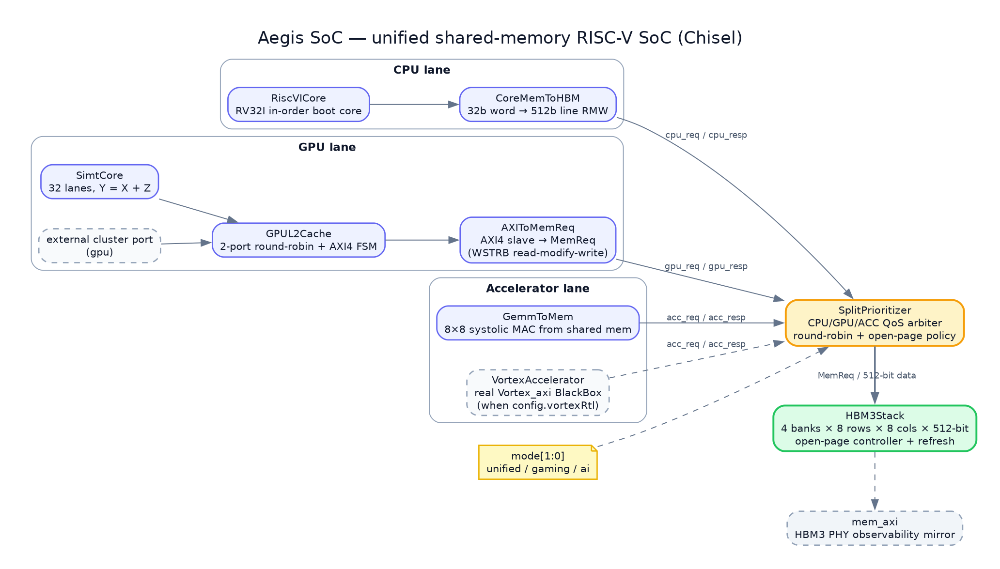
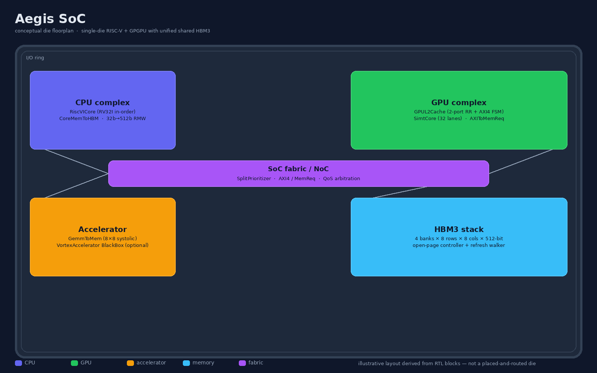
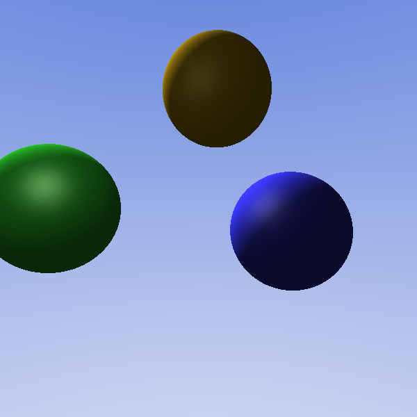
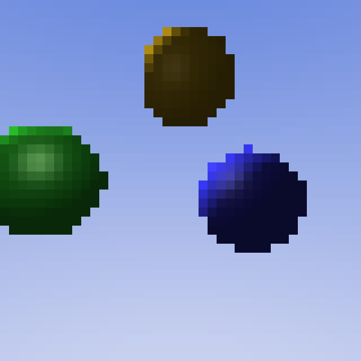
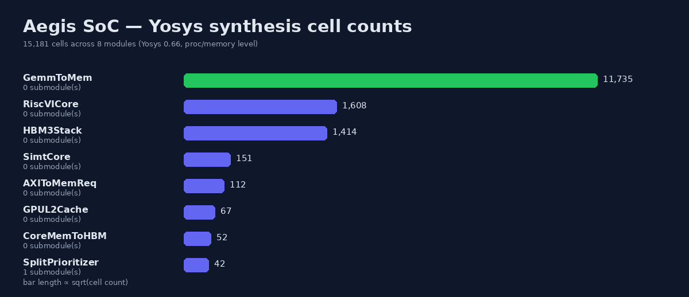
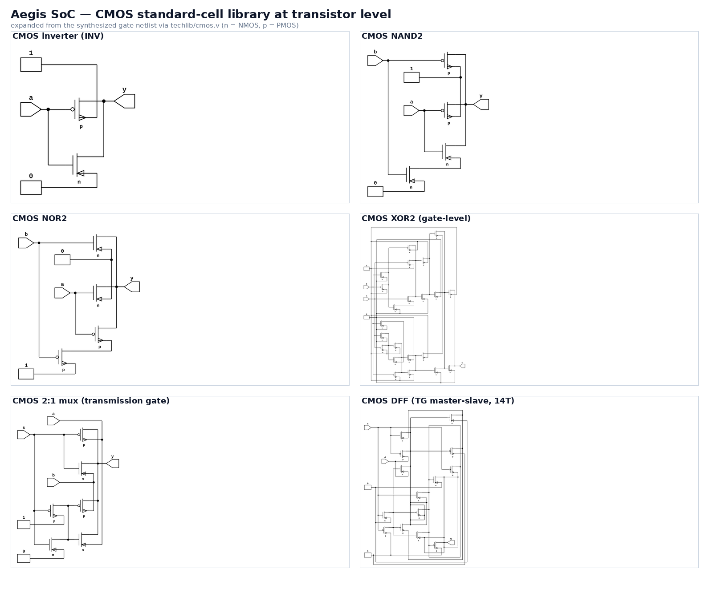
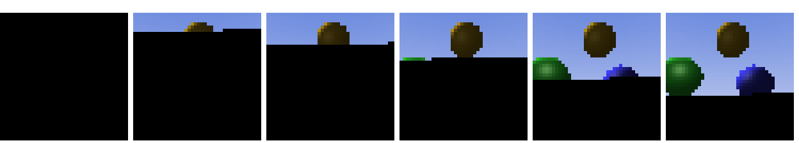

# Aegis SoC

A single-die **RISC-V system-on-chip** written in [Chisel](https://www.chisel-lang.org/), built
around one **unified, self-serving HBM3-class memory stack** shared by a CPU lane, a GPU lane and
a fixed-function accelerator lane. The whole design elaborates, simulates, and co-simulates with
the **real Vortex GPGPU RTL** on a laptop — including a bare-metal raytracer kernel that runs on the
GPU inside the SoC and writes its framebuffer into shared memory.

<p align="center">
  
</p>

---

## Table of contents

- [What it is (and what it deliberately is not)](#what-it-is-and-what-it-deliberately-is-not)
- [Quick start](#quick-start)
- [Architecture](#architecture)
- [Module reference](#module-reference)
- [Unified shared memory](#unified-shared-memory)
- [CPU complex](#cpu-complex)
- [GPU complex](#gpu-complex)
- [Accelerator lane](#accelerator-lane)
- [Top-level interfaces](#top-level-interfaces)
- [Real Vortex co-simulation and the raytracer proof](#real-vortex-co-simulation-and-the-raytracer-proof)
- [Verification](#verification)
- [Gate-level views (Yosys)](#gate-level-views-yosys)
- [Transistor-level (CMOS) view](#transistor-level-cmos-view)
- [Build and run](#build-and-run)
- [Running the interview demo (no compilation)](#running-the-interview-demo-no-compilation)
- [Repository layout](#repository-layout)
- [Modelled vs. target parameters](#modelled-vs-target-parameters)
- [Configuration](#configuration)
- [Troubleshooting / FAQ](#troubleshooting--faq)
- [Engineering highlights](#engineering-highlights)
- [Limitations and roadmap](#limitations-and-roadmap)
- [References and licenses](#references-and-licenses)

---

## What it is (and what it deliberately is not)

Aegis federates three very different requesters onto **one banked DRAM model** and arbitrates
between them in hardware:

| Lane | Blocks | What it does |
|------|--------|--------------|
| **CPU** | `RiscVICore` → `CoreMemToHBM` | In-order **RV32I** boot core with a word-level port widened to 512-bit stack lines |
| **GPU** | `GPUL2Cache` → `AXIToMemReq`, `SimtCore` | Two-port GPU front-end driving real single-beat AXI4 transactions, plus a 32-lane SIMT kernel core |
| **Accelerator** | `GemmToMem` *or* `VortexAccelerator` | 8×8 GEMM engine reading operands from shared memory, or the **real Vortex GPGPU RTL** as a BlackBox |
| **Memory** | `SplitPrioritizer` → `HBM3Stack` | QoS arbitration into a banked DRAM array with an open-page controller and refresh |

**Honest scope.** This is a modelling and verification project, not a tape-out:

- `RiscVICore` is a compact **multi-cycle RV32I** core — no pipeline, no MMU, no exceptions, no
  M/A/F/D/C extensions, no CSRs, no interrupts.
- `SimtCore` is a sequential line-at-a-time element-wise adder, not a warp-scheduled SIMT machine.
- `HBM3Stack` is a **16 KB** banked model, not a 128 GB memory system.
- There is no fab, no PPA-closed standard-cell netlist and no physical layout.

Those limits are stated explicitly so the interesting parts — shared-memory arbitration, the
CPU↔DRAM datapath, and the real-GPU co-simulation — can be verified end to end. See
[Modelled vs. target parameters](#modelled-vs-target-parameters).

---

## Quick start

**Already built? Run the demo with no compilation (recommended for an interview):**

```bash
cd aegis-soc
make run-raytrace --open        # executes the pre-built binary only (~1m40s)
```

**First time (build once, then run):**

```bash
make demo-build                 # one-time Verilator build of the co-simulation
make run-raytrace --open        # run-only from then on
```

**Run the regression suite and inspect the gate/transistor views:**

```bash
make test                       # 13 suites / 27 ChiselSim tests
make verilog-yosys              # Yosys-friendly netlist
make transistors                # CMOS transistor library + counts + SPICE
```

> **Path caveat.** Verilator cannot build in a directory whose path contains spaces. `make test`
> and `scripts/build_demo.sh` detect this and mirror the checkout to a space-free temp dir
> automatically. The run-only path has no such restriction.

---

## Architecture


<p align="center">
  <br/>
  <em>Conceptual floorplan (illustrative, derived from the RTL blocks — not a placed-and-routed die).</em>
</p>

The block set is exactly what `Top` instantiates; it is not aspirational:

```
Top (Aegis)
├── RiscVICore core          RV32I in-order boot core
├── CoreMemToHBM cpuAdp      32-bit word → 512-bit line read-modify-write
├── GPUL2Cache l2            2-port round-robin + single-beat AXI4 FSM
├── SimtCore simt            32 lanes, Y = X + Z over shared memory
├── AXIToMemReq gpuAdp       AXI4 slave → MemReq (WSTRB read-modify-write)
├── GemmToMem gemm           8×8 systolic MAC from shared memory
└── SplitPrioritizer split   CPU/GPU/ACC QoS arbiter
    └── HBM3Stack hbm        4 banks × 8 rows × 8 cols × 512-bit, open-page + refresh
```

When `vortexRtl = true`, `VortexAccelerator` (a `BlackBox` of `VortexShell`, wrapping the
unmodified upstream `Vortex_axi`) replaces `GemmToMem` on the accelerator port. The SoC then
exposes `vx_dcr_*`, `vx_start` and `vx_busy` so a testbench can program and launch the real GPU.

### Data flow

```
        boot program                shared 512-bit fabric
  ┌──────────────────┐
  │  RiscVICore      │
  │  (RV32I)         │──┐
  └──────────────────┘  │ CoreMemToHBM (32b→512b, store RMW)
                        ├──► SplitPrioritizer ──► HBM3Stack ──► mem_axi (mirror)
  ┌──────────────────┐  │       (mode[1:0])
  │  GPUL2Cache      │  │
  │  + SimtCore      │──┤ AXIToMemReq (WSTRB RMW)
  └──────────────────┘  │
  ┌──────────────────┐  │
  │  GemmToMem /     │──┘
  │  VortexAccelerator│
  └──────────────────┘
```

---

## Module reference

| File | Module | Role | Key I/O |
|------|--------|------|---------|
| `Top.scala` | `Top` (`Aegis`) | SoC top; wires CPU/GPU/ACC into the split-prioritizer | `mem_axi`, `mem_mode`, `prog_*`, `gpu`, `simt_*`, `gemm_*`, `vx_*` |
| `cpu/RiscVCore.scala` | `RiscVICore` | RV32I multi-cycle core, 256×32 boot `imem` | `prog_we/addr/data`, `start`, `halt`, `regs`, `mem: WordMemPort` |
| `cpu/CoreMemToHBM.scala` | `CoreMemToHBM` | Widens 32-bit word accesses to 512-bit lines | `word: WordMemPort`, `hbm: MemInterface` |
| `gpu/GPUL2Cache.scala` | `GPUL2Cache` | Cluster round-robin + AXI4 transaction FSM | `cluster: Vec[MemInterface]`, `mem: AXIBundle` |
| `gpu/SimtCore.scala` | `SimtCore` | 32-lane `Y = X + Z` kernel core | `start`, `baseX/Z/Y`, `nLines`, `done`, `mem` |
| `gpu/VortexBlackBox.scala` | `VortexAxiBlackBox`, `VortexAccelerator` | Flat-pin BlackBox of the real Vortex RTL + AXI adapter | `dcr`, `start`, `busy`, `mem` |
| `bridge/AXIToMemReq.scala` | `AXIToMemReq` | AXI4 slave → `MemReq`; WSTRB read-modify-write | `axi: AXIBundle`, `mem: MemInterface` |
| `fixedfunc/GemmToMem.scala` | `GemmToMem` | 8×8 MAC from/to shared memory | `cmd`, `busy`, `mem` |
| `memory/HBM3Stack.scala` | `HBM3Stack` | Banked DRAM array, open-page, refresh, AXI mirror | `req`, `resp`, `open_page`, `pg_active`, `mem` |
| `memory/SplitPrioritizer.scala` | `SplitPrioritizer` | CPU/GPU/ACC QoS arbiter owning the stack | `soc: MemPort`, `mode`, `mem_axi`, `pg_active` |
| `package.scala` | `AegisConfig` | Design-time config | `socName`, `axiAddrWidth`, `axiDataWidth`, `vortexRtl` |
| `types.scala` | `AXIBundle`, `MemReq`, `MemInterface`, `MemPort`, … | Shared bundles | — |
| `elaborate/package.scala` | `TopElaborate`, `TopVortexElaborate`, `TopYosysElaborate` | CIRCT emission helpers | — |

---

## Unified shared memory

```
RV32I CPU  ── cpu_req/resp ──┐
GPU L2     ── gpu_req/resp ──┼──► SplitPrioritizer ──► HBM3Stack ──► mem_axi (mirror)
GEMM/Vortex── acc_req/resp ──┘          (mode[1:0])
```

### `HBM3Stack`

- A real register array: **4 banks × 8 rows × 8 columns of 512-bit words = 16 KB**, with
  64-byte (512-bit) lines.
- Decodes address → `{line, column, bank, row}` and tracks per-bank open pages with `tACT`/`tPRE`
  timing (`HBM3Stack.scala:53-55`).
- A refresh walker periodically blocks new requests and walks the banks (`tREF`).
- Reads are served **from the array**, so written data physically persists across a test.
- `io.mem` is an AXI **observability mirror** of the current PHY transaction — completion never
  depends on it.
- Only `addr[13:6]` is decoded, so the 16 KB model aliases addresses modulo 16 KB; the testbench
  places its code, framebuffer and stack in disjoint low regions.

### `SplitPrioritizer`

One stack, three requesters. `mode[1:0]` selects the QoS policy:

| `mode` | Name | Policy |
|--------|------|--------|
| `0` | unified | fair rotating-priority round-robin across CPU / GPU / ACC |
| `1` | gaming | CPU strict priority; GPU and ACC round-robin the rest |
| `2` | ai | CPU strict priority **and** HBM3 open-page (row-buffer) policy |

Responses are tagged with the requester that was granted, so data always returns on the port that
issued the request.

---

## CPU complex

`RiscVICore` implements the **RV32I base integer subset**:

- LUI, AUIPC, JAL, JALR; BEQ/BNE/BLT/BGE/BLTU/BGEU
- LB/LH/LW/LBU/LHU, SB/SH/SW
- ADDI/SLTI/SLTIU/XORI/ORI/ANDI/SLLI/SRLI/SRAI
- ADD/SUB/SLL/SLT/SLTU/XOR/SRL/SRA/OR/AND

It is a single-instruction multi-cycle machine (no pipeline, no hazards by construction) that
fetches from a 256×32 boot `imem` programmed through `prog_we/prog_addr/prog_data`. The sentinel
instruction `0xFFFFFFFF` (`isHalt`) stops it and raises `halt`. `regs` exposes the 32 architectural
registers for post-run checking.

`CoreMemToHBM` widens every access to a 64-byte line:

- loads align to `addr[63:6]<<6`, shift the returned line down and slice by size
  (byte/half/word, sign-extended);
- every store is a **read-modify-write** (the core is single-outstanding), merging the store bytes
  into the fetched line before writing it back.

`Asm.scala` in the test tree is a hand-assembled RV32I encoder used by the tests and the co-sim
testbench (no compiler/toolchain dependency).

---

## GPU complex

- **`GPUL2Cache`** round-robin arbitrates its two cluster ports (the external `gpu` port and the
  on-die `SimtCore`), then runs a real single-beat AXI4 FSM (`AW/W/B` for stores, `AR/R` for loads)
  and returns the data that actually came back from memory to the issuing cluster.
- **`AXIToMemReq`** bridges AXI4 to the shared `MemReq` fabric. When `WSTRB` is not all-ones it
  performs a **read-for-ownership merge** so a partial store cannot clobber untouched bytes on the
  512-bit bus, and it echoes `BID = AWID` / `RID = ARID` (this is what unblocked real GPU
  dcache fills).
- **`SimtCore`** executes an element-wise `Y = X + Z` kernel over arrays in the shared HBM3
  (32 lanes of 16-bit adds packed into 512-bit lines, one line per step) and raises `simt_done`.

---

## Accelerator lane

- **`GemmToMem`** (`tile = 8`) reads an `A` tile (`T×T`, 16-bit) at `base`, a `B` tile at
  `base + T*T*2`, computes the product on a systolic-style datapath, and writes a `C` tile
  (`T×T`, 32-bit) at `base + T*T*4` — all through the shared stack, so the CPU/GPU can seed it.
- **`VortexAccelerator`** (when `config.vortexRtl = true`) black-boxes the real upstream
  `Vortex_axi` RTL behind `test/vortex/VortexShell.sv` and adapts its AXI master onto the same
  accelerator port, exposing `vx_dcr_*`, `vx_start`, `vx_busy`.

---

## Top-level interfaces

| Port | Dir | Width | Meaning |
|------|-----|-------|---------|
| `mem_axi` | out | AXI4 64/512 | HBM3 PHY observability mirror |
| `mem_mode` | out | 2 | current QoS mode |
| `debug_uart` | out | UART | reserved / `DontCare` |
| `prog_we`, `prog_addr`, `prog_data` | in | 1 / 8 / 32 | boot-program write port |
| `start`, `halt` | in/out | 1 | CPU run / halted |
| `regs` | out | 32×32 | architectural register file |
| `gpu` | in | `MemInterface` | external GPU cluster port |
| `simt_start`, `simt_baseX/Z/Y`, `simt_nLines` | in | 1 / 64 / 16 | SIMT kernel launch |
| `simt_done` | out | 1 | SIMT completion |
| `gemm_start`, `gemm_base`, `gemm_busy` | in/out | 1 / 64 / 1 | GEMM accelerator |
| `vx_dcr_*`, `vx_start`, `vx_busy` | in/out | — | real Vortex control (DCR, launch, busy) |

---

## Real Vortex co-simulation and the raytracer proof

`vortex/` is a vendored copy of upstream **Vortex 3.0** (Apache-2.0). The author's glue is
`src/main/scala/aegis/gpu/VortexBlackBox.scala`, `test/vortex/VortexShell.sv` (a flat-pin wrapper)
and the testbenches. The emitted SoC and the real RTL are co-simulated **out of tree** with
Verilator in three escalating scopes:

1. **standalone** — compile `VortexShell` + real RTL and drive the DCR/start/busy pins;
2. **co-elaboration** — lint the emitted `Aegis.sv` together with the real Vortex RTL;
3. **end-to-end** — build and run `Aegis` + real Vortex, program a kernel through the SoC's own
   `vx_dcr_*`/`vx_start` pins, and observe `vx_busy` plus HBM3 mirror traffic.

The headline workload is a **bare-metal RV32IMF raytracer kernel** (`test/vortex/rt_balls.rs`,
`#![no_std]`, custom Vortex entry/exit asm, fast inverse-sqrt) that renders three reflective
spheres with a sky gradient into the shared HBM3. `test/vortex/golden.py` is a double-precision
host render of the *same scene*; the RTL testbench compares every framebuffer word against it with
a per-channel tolerance of ±4.

<table>
<tr>
<td align="center"><br/>
<em>Host reference render (600×600) of the scene the Vortex kernel executes.</em></td>
<td align="center"><br/>
<em>Framebuffer written by the real Vortex RTL inside the SoC (40×40, upscaled).</em></td>
</tr>
</table>

**Result — the co-simulation was run and passes.** The kernel ran from shared HBM3, the RV32I CPU
loop read the same memory back, and the read-back framebuffer matched the golden within ±4 per
channel — **1600 / 1600 pixels within tolerance, 1595 exact, mean channel error 0.0013**, with
`vx_busy`, AXI read/write, magic store and shared-memory store all observed. Raw evidence:
[`docs/cosim_result.txt`](docs/cosim_result.txt).

```bash
make raytrace         # render the host reference scene to docs/raytrace.png
make run-raytrace     # run the pre-built co-sim (no compilation)
```

---

## Verification

All tests are ChiselSim (Verilator-backed) ScalaTests plus structural elaboration tests.
Current status: **13 suites, 27 tests, all passing** (`make test`).

| Suite | Covers |
|-------|--------|
| `SimulationSmokeTest` | simulator sanity |
| `RiscVICoreTest` | arithmetic/logic, internal load/store, branches, JAL/JALR |
| `RiscVICoreMemTest` | core → `CoreMemToHBM` → splitter → HBM3 round-trips |
| `HBM3StackTest` | write persistence, open-page keep/close policy |
| `SplitPrioritizerTest` | CPU/GPU routing, gaming CPU priority, AI open-page, shared data integrity |
| `AXIToMemReqTest` | full-line AXI store + load through HBM3 |
| `GPUL2CacheMemTest` / `GPUL2CacheTest` | cluster round-robin and shared-memory round-trip |
| `SimtCoreTest` | `Y = X + Z` kernel through the real L2/AXI path |
| `GemmSharedAccTest` | 8×8 GEMM on shared memory vs. a software reference |
| `SoCCpuMemTest` | CPU writes / GPU reads the same HBM3 line and vice versa |
| `TopSmokeTest` | full `Top`: CPU boot, GPU↔CPU sharing, GEMM and SIMT inside the SoC |
| `VortexBlackBoxEmitTest` | real-Vortex BlackBox present/absent in emitted SV |

A raw-Verilator smoke harness (`test/Makefile.test`, `test/test_bench.cpp`) additionally compiles
the emitted `Aegis.sv` and runs 1010 ticks.

```bash
make test                          # full sbt/ScalaTest suite
make verilator                     # raw-Verilator harness
cd test && make -f Makefile.test test
```

---

## Gate-level views (Yosys)

`make verilog-yosys` emits a Yosys-friendly netlist (firtool `disallowLocalVariables` +
`disallowPackedArrays`) which is synthesized with **Yosys 0.66**.

<p align="center">
  
</p>

- `docs/aegis_yosys_cells.png` — **15,181 cells across 8 modules** (proc/memory level). `GemmToMem`
  dominates at 11,735 cells (its register tile), then `RiscVICore` 1,608 and `HBM3Stack` 1,414.
- `docs/aegis_yosys_stat.txt` — full Yosys `stat`, including per-cell-type breakdowns.
- `docs/schematic_AXIToMemReq.png`, `docs/schematic_CoreMemToHBM.png` — Yosys `show` netlist
  schematics.
- `docs/aegis_gate_CoreMemToHBM.v` — gate-level netlist after `synth` + `abc`.

```bash
make verilog-yosys
yosys -p "read_verilog -sv build/rtl-yosys/Aegis.sv; hierarchy -top Aegis; proc; opt; memory -nomap; opt_clean; stat -top Aegis"
yosys -p "read_verilog -sv build/rtl-yosys/Aegis.sv; hierarchy -top CoreMemToHBM; proc; opt; show -format png -prefix sch_core CoreMemToHBM"
```

---

## Transistor-level (CMOS) view

Below gates, the synthesized netlist is mapped to real `nmos`/`pmos` transistor networks with
`techlib/cmos.v` (combinational cells are exact CMOS networks; registers are the 14-transistor
transmission-gate master-slave DFF plus enable/reset steering muxes), then rendered with
`netlistsvg` and the MOSFET skin `scripts/cmos_skin.svg`.

<p align="center">
  
</p>

`make transistors` regenerates the cell-library figure, the per-block transistor counts
(`docs/aegis_transistor_counts.txt`) and a transistor-level SPICE netlist
(`docs/aegis_arbiter_transistors.spice`). Structural transistor counts:

| Block | Transistors |
|-------|------------:|
| SplitPrioritizer (arbiter) | 12,870 |
| CoreMemToHBM | 43,192 |
| AXIToMemReq | 18,518 |
| GPUL2Cache | 32,126 |
| SimtCore | 67,948 |
| GemmToMem | 204,702 |
| RiscVICore | 365,008 |
| HBM3Stack | 4,723,348 |
| **Total** | **5,467,712** |

`HBM3Stack` dominates because it is the 131,072-bit register file plus its read/decode logic. A
**full-module** transistor graph is far too dense to render legibly, so the transistor deliverable
is the cell library figure, the per-block counts and the SPICE netlist; a physical transistor
*layout* would additionally need a PDK and an OpenLane/OpenROAD flow.

---

## Build and run

### Prerequisites

| Tool | Version used |
|------|--------------|
| JDK | 17+ (26 used here) |
| sbt | 1.10.10 |
| Scala / Chisel | 2.13.17 / 7.3.0 |
| Verilator | 5.052 |
| Python 3 | 3.14 (+ Pillow) |
| Graphviz (`dot`) | for diagrams |
| Node / npx | for `netlistsvg` (transistor views only) |
| rustc + `riscv32imafc-unknown-none-elf` | only to rebuild `rt_balls.rs` |

### Make targets

```bash
make compile         # compile Scala/Chisel
make verilog         # elaborate Top -> build/rtl/Aegis.sv (+ verification tree)
make verilog-vortex  # same SoC with the real Vortex RTL on the acc port
make verilog-yosys   # Yosys-friendly emission for gate-level analysis
make test            # ScalaTest suite (13 suites / 27 tests)
make verilator       # raw-Verilator smoke harness
make raytrace        # render the raytracer reference scene to docs/raytrace.png
make transistors     # transistor-level CMOS views + counts + SPICE netlist
make demo-build      # one-time Verilator build of the co-simulation
make run-raytrace    # run the pre-built raytracer binary (no compilation)
make clean
```

### Host requirements and cost

- Tuned for a **14 GB / 12-core laptop**.
- Full Verilator build of `Aegis` + real Vortex: **230 modules / ~119 MB of generated C++**;
  `build/` is about **644 MB**; peak Verilator allocation ~736 MB; the `make -j2` step is kept low
  to protect memory.
- The one-time build (`make demo-build`) takes roughly **4 minutes** here; later runs reuse the
  cache.
- The test suite takes roughly **4 minutes**.

---

## Running the interview demo (no compilation)

Build once beforehand, then run only the binary during the interview. Nothing is compiled live.

```bash
# 1) Do this once, before the interview:
cd aegis-soc
make demo-build                 # ~4 min, produces build/vortex-smoke/obj_dir-soc/VAegis

# 2) During the interview -- run-only, no make/verilator/sbt:
make live                       # live window + MP4 (recommended)
make run-raytrace --open        # or the simple run; opens docs/raytrace_rtl_live.png
```

### Live, cinematic rendering

`make live` streams the framebuffer **while the kernel is still running on the real RTL** and shows
it building up in a window, so the audience watches the GPU render instead of waiting for a final
picture:

- The testbench reads the partially-written framebuffer out of shared HBM3 every 100k cycles and
  writes it as a PPM frame. No extra cache maintenance is needed: the pixels reach DRAM
  progressively, so the image fills in on its own.
- `scripts/live_view.py` displays the frames with a HUD — simulation cycles, pixels written to
  HBM3, `vx_busy`, and a progress bar — ending with "RENDER COMPLETE (framebuffer verified vs
  golden)".
- The same run captures numbered frames and, with ffmpeg, assembles `docs/raytrace_rtl.mp4`
  (~6 s at 12 fps). It is committed, so you can play it even without running anything.

<p align="center">
  <br/>
  <em>Frames captured during one real RTL run (step 0 → sky → gold → green/blue spheres).</em>
</p>

Both paths use the pre-built binary; nothing is compiled live, and the scene is genuinely produced
by the real Vortex GPGPU executing the raytracer kernel inside the Aegis SoC.

What the audience sees: the real Vortex GPU executing the raytracer inside the SoC, then

```
vx_busy: yes busy_dropped: yes read_req: yes write_req: yes mirror_magic: yes shared_mem_store: yes
rt framebuffer: 1600 pixels, exact=1595, within tol(4)=1600, worst_ch_delta=1 -> PASS
PASS: Aegis + real Vortex RTL end-to-end, kernel ran from shared HBM3, CPU loop summed shared HBM3,
      raytracer framebuffer verified vs golden
```

and the framebuffer PNG. Suggested narrative: show the block diagram and floorplan, then the
co-sim PASS, then the host reference (`docs/raytrace.png`) vs the RTL output
(`docs/raytrace_rtl.png`), then drop to `docs/aegis_yosys_cells.png` (gate level) and
`docs/transistors_cells.png` (transistor level).

The pre-built binary is self-contained and reads `test/vortex/rt_balls.bin` +
`test/vortex/rt_balls_golden.bin` via environment variables. If the binary is missing,
`scripts/run_raytrace.sh` tells you to run `make demo-build` once.

---

## Repository layout

```
src/main/scala/aegis/
├── Top.scala                 SoC top: CPU + GPU + acc sharing SplitPrioritizer
├── package.scala             AegisConfig
├── types.scala               AXI4 / MemReq / MemInterface bundles
├── cpu/                      RiscVCore, CoreMemToHBM
├── gpu/                      GPUL2Cache, SimtCore, VortexBlackBox (VortexAccelerator)
├── fixedfunc/                GemmToMem
├── memory/                   HBM3Stack, SplitPrioritizer
└── elaborate/                CIRCT emit helpers (TopElaborate, TopVortexElaborate, TopYosysElaborate)

techlib/                      cmos.v (gate -> nmos/pmos transistor mapping)
src/test/scala/aegis/         ChiselSim + emit suites
test/                         raw-Verilator harness
test/vortex/                  real-Vortex co-sim, raytracer kernel + golden renderer
vortex/                       vendored upstream Vortex 3.0 RTL (Apache-2.0)
docs/                         block diagram, floorplan, raytracer renders + live MP4,
                              Yosys views, transistor-level cell library + counts
scripts/                      build_demo.sh, run_raytrace.sh, demo_raytrace.sh, simulate.py,
                              render_floorplan.py, render_yosys_summary.py,
                              render_transistors.py, transistor_flow.sh, cmos_skin.svg
```

---

## Modelled vs. target parameters

The project deliberately models small, *verifiable* numbers rather than hyperscale ones. This
table is the single source of truth so documentation and RTL cannot drift apart:

| Subsystem | Modelled here (verified) | Design target (illustrative) |
|-----------|--------------------------|------------------------------|
| Memory | 16 KB banked HBM3 model, 512-bit, 4 banks × 8 rows × 8 cols | 256 MB unified LPDDR5-class @ 3.2 Gbps |
| CPU | 1× RV32I in-order multi-cycle boot core, 512-bit shared path | 4 cores @ 1–3 GHz, L1/L2/L3 hierarchy |
| GPU | 2-port L2 front-end + 32-lane SIMT core; optional real Vortex 3.0 RTL | 8 clusters / 64 SIMT cores @ 1.5 GHz |
| Accelerator | 8×8 GEMM from shared memory | larger GEMM + ray-tracing / AI-upscale blocks |
| AXI | 64-bit addr, 512-bit data, 8-bit IDs | — |

`AegisConfig` contains only the parameters that are actually instantiated; every block's geometry
lives in its own module.

---

## Configuration

```scala
case class AegisConfig(
  socName:      String  = "Aegis",  // top module / emitted file name
  axiAddrWidth: Int     = 64,       // AXI address width
  axiDataWidth: Int     = 512,      // AXI data width (one HBM3 line)
  vortexRtl:    Boolean = false,    // BlackBox the real Vortex RTL on the acc port
)
```

`defaultConfig` is available for tests; `TopVortexElaborate` uses `AegisConfig(vortexRtl = true)`.

---

## Troubleshooting / FAQ

**`make test` or `make demo-build` fails with "GNU Make cannot build in directories containing
spaces".** Verilator's generated makefiles cannot handle spaces. `make test` and
`scripts/build_demo.sh` auto-mirror to a space-free temp dir; you can also clone to a path without
spaces. The run-only path has no such restriction.

**The first build is slow.** It compiles ~230 RTL modules with Verilator (about 4 minutes here).
Do it once with `make demo-build`; afterwards `make run-raytrace` only executes the binary
(~1m40s).

**"pre-built binary not found".** Run `make demo-build` once; `scripts/run_raytrace.sh` needs
`build/vortex-smoke/obj_dir-soc/VAegis`.

**Out-of-memory during the Verilator build.** The script drives `make -j2` deliberately. Close
other memory-heavy processes, or build on a machine with ≥ 12 GB RAM.

**Can I change the render resolution?** The committed kernel is 40×40. `RT_W`/`RT_H` select the
golden/scene size, but a different kernel size requires rebuilding `rt_balls.rs` with
`test/vortex/build_rt.sh` (needs the `riscv32imafc-unknown-none-elf` Rust target).

**Where are the waveforms?** Add `AEGIS_TRACE=$PWD/build/aegis.vcd` to the run command to capture a
VCD; view it with `gtkwave` or `surfer` (neither is installed here — `sudo pacman -S gtkwave`).
Full-run VCDs are large, so capture short runs only.

**Is this a real PlayStation or a real chip?** No. Aegis is a RISC-V SoC model verified in
simulation. (ShadPS5, a separate project, is the PS5 compatibility layer.) There is no silicon.

**Does it boot Linux / run real games?** No — the CPU is a small RV32I boot core and the GPU is a
kernel-level SIMT/Vortex model, not a full driver stack.

---

## Engineering highlights

- **A self-serving DRAM model in synthesizable Chisel** — real banked array, address decode,
  open-page activate/precharge timing, refresh, and register-file persistence (not a testbench
  echo).
- **Unified-memory arbitration with QoS modes** — one stack, three requesters, tagged responses,
  fair or CPU-prioritised scheduling, and an open-page mode for throughput.
- **A correct 32→512-bit memory path** — byte/half/word load sign-extension and store
  read-modify-write, proven end to end against the DRAM array from a booted RV32I program.
- **The AXI `WSTRB` read-modify-write fix** and response-ID echo — the subtle correctness details
  that unblocked real GPU cache-line fills.
- **Black-boxing unmodified upstream Vortex** with a thin flat-pin wrapper instead of forking it,
  and co-simulating it out of tree in three escalating scopes.
- **A bare-metal Rust raytracer as a hardware test vector** — `no_std`, custom entry/exit asm,
  fast inverse-sqrt, verified pixel-by-pixel against a double-precision Python golden model.
- **A full tool ladder for one design** — Chisel → SystemVerilog → Yosys gate-level stats/schematics
  → CMOS transistor networks + SPICE — from the same source of truth.

---

## Limitations and roadmap

**Limitations**

- `RiscVICore` is RV32I only, multi-cycle, with no pipeline/MMU/exceptions; `SimtCore` is
  line-sequential; `HBM3Stack` is 16 KB.
- The `vortex/` tree is vendored upstream RTL, not authored here.
- The transistor-level registers are a structural model (14T TG DFF + steering muxes), not a
  timing-closed standard cell; there is no PPA or physical layout.

**Roadmap**

- [ ] Add a pipeline and small I/D caches to `RiscVICore`
- [ ] Warp-schedule `SimtCore` (multiple warps per cluster)
- [ ] Expose performance counters for the QoS arbiter
- [ ] Wider Vortex configuration once host RAM allows

---

## References and licenses

| Component | License | URL |
|-----------|---------|-----|
| Chisel / FIRRTL / CIRCT | Apache-2.0 | https://github.com/chipsalliance/chisel |
| Vortex (vendored in `vortex/`) | Apache-2.0 | https://github.com/vortexgpgpu/vortex |
| Verilator | LGPL-3.0 / Artistic-2.0 | https://github.com/verilator/verilator |
| Yosys | ISC | https://github.com/YosysHQ/yosys |
| netlistsvg | MIT | https://github.com/nturley/netlistsvg |

The `vortex/` tree is a vendored copy of upstream Vortex 3.0 retained for the out-of-tree
co-simulation; the author's original work is the Chisel SoC plus the glue/testbench files listed
above.
